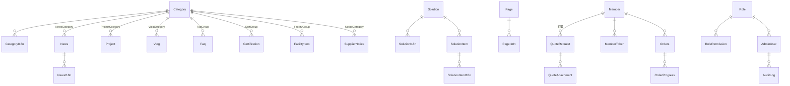

# 08 · 資料庫設計 Database — 規格書

| 欄位 | 內容 |
|------|------|
| **主責 Agent** | `system-analyst`（schema 定義）+ `backend-engineer`（建置／遷移） |
| **對應階段** | P1（ER Model 藍圖）／P4（建表與實作） |
| **技術基線** | Azure SQL Database — Basic ／ Dapper（手寫 SQL）／ Azure Functions .NET 10 |
| **配套文件** | [09-cms-admin.md](09-cms-admin.md)（後台單元 → 本文件資料表對照）、[04-api.md](04-api.md)（契約）、[05-seo.md](05-seo.md)（SEO 欄位） |
| **資料來源** | `mockup/` 44 頁實際結構（2026-09-01 定案版）、[官網資訊架構 IA](../reference/官網資訊架構_IA.md) |

---

## 1. 設計原則（三條專案決議）

| # | 決議 | 落到 schema 的做法 |
|---|------|-------------------|
| 1 | **後台以「單元功能」為主** | 每個後台單元 = 1 個主表（＋1 個 i18n 子表）；不做通用 page-builder、不做區塊拖拉。單元清單見 [09-cms-admin.md](09-cms-admin.md)。 |
| 2 | **不做 Media Library** | 沒有 `Media` 資產表。檔案／圖片一律是**所屬資料列上的欄位**（`XxxPath` 存 Blob 相對路徑），刪除該列即解除引用。 |
| 3 | **固定文字不進後台** | About／Sustainability／Facility 各內頁的長篇敘述文字寫死在前端；資料庫只保留這些頁的 **SEO 欄位**（`Page` / `PageI18n`）。 |

> 例外只有一處：`privacy-legal` 屬法務文件、客戶會自行改版，故 `Page.HasRichBody = 1` 開富文本。

---

## 2. 共用慣例

### 2.1 命名
- 資料表 **PascalCase 單數**（`News`、`QuoteRequest`）；多語子表固定後綴 **`I18n`**（`NewsI18n`）。
- 主鍵一律 `Id INT IDENTITY(1,1)`（log 類用 `BIGINT`）；外鍵 `{Table}Id`。
- 布林 `Is*` / `Has*`；時間點 `*At`；排序 `SortOrder`。
- 狀態欄位用**可讀字串碼**（`VARCHAR(20)` + `CHECK`），不用數字 enum — 手寫 SQL 除錯時直接看得懂。

### 2.2 時間與時區
- 一律 `DATETIME2(0)`，**存 UTC**（`SYSUTCDATETIME()`）；顯示時由前端／後台轉 `Asia/Taipei`。
- 純日期性質（新聞發佈日、公告日）用 `DATE`，不帶時區問題。

### 2.3 稽核與軟刪（所有內容表皆含）

```sql
CreatedAt DATETIME2(0) NOT NULL DEFAULT SYSUTCDATETIME(),
CreatedBy INT NULL, UpdatedAt DATETIME2(0) NULL, UpdatedBy INT NULL,
IsDeleted BIT NOT NULL DEFAULT 0
```

下方 DDL 中以單行 `/* audit */` 代表這五個欄位（實作時展開）。`CreatedBy/UpdatedBy` 指向 `AdminUser.Id`，不建 FK（避免管理員刪除時的連鎖限制）。

### 2.4 上下架
內容表統一四欄：`IsPublished BIT`、`PublishAt DATETIME2(0) NULL`、`UnpublishAt DATETIME2(0) NULL`、`SortOrder INT`。
前台查詢一律套用：

```sql
WHERE IsDeleted = 0 AND IsPublished = 1
  AND (PublishAt   IS NULL OR PublishAt   <= SYSUTCDATETIME())
  AND (UnpublishAt IS NULL OR UnpublishAt >  SYSUTCDATETIME())
```

### 2.5 多語（中／英）
- 語系中性欄位（圖片路徑、日期、排序、狀態、外部連結）留在**主表**。
- 可翻譯文字（標題、內文、slug、圖片 `alt`、SEO）放 **`{Entity}I18n`**，PK = (`{Entity}Id`, `Lang`)。
- `Lang VARCHAR(5)`，本期值域 `'zh'` / `'en'`（保留擴充為 `zh-TW`／`ja` 的空間）。
- **缺語系不 fallback**：某語系沒有 i18n 列 → 該語系前台不列出這筆。後台清單以「中/英完成度」badge 提示（對應規劃書「語系管理：中英內容對照維護」）。
- slug 放 i18n，允許中英不同網址；唯一索引為 (`Lang`, `Slug`)。

### 2.6 圖片／檔案欄位（呼應決議 2）
每個上傳欄位是一組三件：

| 欄位 | 位置 | 說明 |
|------|------|------|
| `XxxPath` | 主表 `NVARCHAR(260)` | Blob 相對路徑，如 `news/2026/03/taicca-partnership.webp` |
| `XxxAlt` | i18n 表 `NVARCHAR(200)` | 圖片替代文字，**中英各一**（05-seo 硬性要求） |
| 建議尺寸 note | 後台 UI 常數 | 不入庫，寫在後台欄位定義；總表見 [09-cms-admin.md §3](09-cms-admin.md) |

上傳處理（後端）：驗副檔名白名單 → 驗實際 magic number → 寫入 Blob → 影像另存 WebP 衍生檔（原檔保留）→ 回寫 `XxxPath`。**不建立資產表**；孤兒檔由每月排程比對欄位引用後清除。

### 2.7 SEO 欄位組
凡是**有自己網址**的實體（`Page`、`News`、`Solution`），其 i18n 表都含這組：

```sql
Slug NVARCHAR(160) NOT NULL, SeoTitle NVARCHAR(70) NULL, SeoDescription NVARCHAR(180) NULL,
CanonicalUrl NVARCHAR(300) NULL, OgTitle NVARCHAR(90) NULL, OgDescription NVARCHAR(200) NULL
```

`OgImagePath` 為語系中性，放主表。`hreflang` 不落欄位，由同一 `Id` 的兩筆 i18n 推導。

---

## 3. ER 概觀



分區一覽（**31 張主表 + 16 張 `*I18n` 多語子表 = 47 張**）：

| 區 | 資料表 |
|----|--------|
| 共用主檔 | `Category`、`CategoryI18n`、`SiteSetting` |
| 首頁 | `HomeBanner`、`HomeBannerI18n` |
| 內容 | `Solution`(+I18n)、`SolutionItem`(+I18n)、`Project`(+I18n)、`News`(+I18n)、`Vlog`(+I18n)、`Faq`(+I18n)、`IndustryTrend`(+I18n)、`Certification`(+I18n)、`ClientLogo`、`FacilityItem`(+I18n)、`JobPosting`(+I18n) |
| 供應商 | `SupplierNotice`(+I18n)、`SupplierSpec`(+I18n)、`SupplierDownload`(+I18n) |
| 頁面／SEO | `Page`、`PageI18n`、`Redirect` |
| 表單 | `QuoteRequest`、`QuoteAttachment`、`ContactMessage` |
| 會員（P6） | `Member`、`MemberToken`、`Orders`、`OrderProgress` |
| 系統 | `AdminUser`、`Role`、`RolePermission`、`AuditLog`、`EmailLog` |

---

## 4. DDL

### 4.1 共用主檔

```sql
-- 統一分類主檔：以 CategoryType 分流，後台為單一「分類管理」單元
CREATE TABLE dbo.Category (
  Id INT IDENTITY(1,1) PRIMARY KEY,
  CategoryType VARCHAR(30) NOT NULL,   -- News|Project|Vlog|Faq|Certification|Facility|SupplierNotice|Industry|QuoteMaterial
  Code VARCHAR(40) NOT NULL,           -- 程式用固定碼，建立後不可改
  SortOrder INT NOT NULL DEFAULT 0,
  IsActive BIT NOT NULL DEFAULT 1,
  /* audit */
  CONSTRAINT UQ_Category_Type_Code UNIQUE (CategoryType, Code),
  CONSTRAINT CK_Category_Type CHECK (CategoryType IN
    ('News','Project','Vlog','Faq','Certification','Facility','SupplierNotice','Industry','QuoteMaterial'))
);

CREATE TABLE dbo.CategoryI18n (
  CategoryId INT NOT NULL REFERENCES dbo.Category(Id),
  Lang VARCHAR(5) NOT NULL,
  Name NVARCHAR(80) NOT NULL,
  CONSTRAINT PK_CategoryI18n PRIMARY KEY (CategoryId, Lang)
);

-- 全站設定：key-value，後台以固定 key 清單渲染表單（見 §6.3 種子）
CREATE TABLE dbo.SiteSetting (
  SettingKey VARCHAR(60) NOT NULL PRIMARY KEY,
  GroupName VARCHAR(30) NOT NULL,      -- Company|Social|Home|Mail
  ValueType VARCHAR(10) NOT NULL,      -- text|multiline|image|url|email|html
  IsLocalized BIT NOT NULL DEFAULT 0,
  ValueZh NVARCHAR(MAX) NULL,
  ValueEn NVARCHAR(MAX) NULL,
  SortOrder INT NOT NULL DEFAULT 0,
  UpdatedAt DATETIME2(0) NULL, UpdatedBy INT NULL
);
```

### 4.2 首頁

```sql
-- 首頁 Banner 輪播（mockup index.html #hero，目前 3 張）
CREATE TABLE dbo.HomeBanner (
  Id INT IDENTITY(1,1) PRIMARY KEY,
  ImagePath NVARCHAR(260) NOT NULL,        -- 建議 2400x900
  ImagePathMobile NVARCHAR(260) NULL,      -- 建議 1080x1350，未填則用桌機圖
  LinkUrl NVARCHAR(300) NULL,              -- 站內相對路徑或外部 URL
  OpenInNewTab BIT NOT NULL DEFAULT 0,
  SortOrder INT NOT NULL DEFAULT 0,
  IsPublished BIT NOT NULL DEFAULT 1, PublishAt DATETIME2(0) NULL, UnpublishAt DATETIME2(0) NULL,
  /* audit */
);

CREATE TABLE dbo.HomeBannerI18n (
  HomeBannerId INT NOT NULL REFERENCES dbo.HomeBanner(Id),
  Lang VARCHAR(5) NOT NULL,
  ImageAlt NVARCHAR(200) NOT NULL,
  CONSTRAINT PK_HomeBannerI18n PRIMARY KEY (HomeBannerId, Lang)
);
```

> 首頁 **What We Do**（4 格）、**Why global brands choose NTI?**（6 格）、形象圖帶標語皆為品牌簡報照抄的固定文案 → **不入庫**（決議 3）。形象圖帶的圖片本身走 `SiteSetting['home.gallery_image']`。

### 4.3 Solutions（客製化解決方案）

```sql
-- 4 個方案 = products-boxes / cardboard / uv / other，同時驅動首頁 Printing Solutions 四張卡
CREATE TABLE dbo.Solution (
  Id INT IDENTITY(1,1) PRIMARY KEY,
  Code VARCHAR(30) NOT NULL UNIQUE,        -- boxes|cardboard|uv|other
  CoverImagePath NVARCHAR(260) NOT NULL,   -- 建議 1160x940
  OgImagePath NVARCHAR(260) NULL,          -- 建議 1200x630
  SortOrder INT NOT NULL DEFAULT 0,
  IsPublished BIT NOT NULL DEFAULT 1, PublishAt DATETIME2(0) NULL, UnpublishAt DATETIME2(0) NULL,
  /* audit */
);

CREATE TABLE dbo.SolutionI18n (
  SolutionId INT NOT NULL REFERENCES dbo.Solution(Id),
  Lang VARCHAR(5) NOT NULL,
  Name NVARCHAR(80) NOT NULL,              -- Color Box Packaging
  H1 NVARCHAR(160) NOT NULL,               -- Custom Color Box Packaging
  Summary NVARCHAR(300) NULL,              -- 首頁卡片／列表用短述
  IntroHtml NVARCHAR(MAX) NULL,            -- 方案頁導言（富文本）
  CoverAlt NVARCHAR(200) NOT NULL,
  Slug NVARCHAR(160) NOT NULL, SeoTitle NVARCHAR(70) NULL, SeoDescription NVARCHAR(180) NULL,
  CanonicalUrl NVARCHAR(300) NULL, OgTitle NVARCHAR(90) NULL, OgDescription NVARCHAR(200) NULL,
  CONSTRAINT PK_SolutionI18n PRIMARY KEY (SolutionId, Lang)
);

-- 方案頁內的品項卡（Gluing Box / Bottom Gluing Box / ... 共 6+ 張）
CREATE TABLE dbo.SolutionItem (
  Id INT IDENTITY(1,1) PRIMARY KEY,
  SolutionId INT NOT NULL REFERENCES dbo.Solution(Id),
  ImagePath NVARCHAR(260) NOT NULL,        -- 建議 1280x960
  SortOrder INT NOT NULL DEFAULT 0,
  IsPublished BIT NOT NULL DEFAULT 1,
  /* audit */
);

CREATE TABLE dbo.SolutionItemI18n (
  SolutionItemId INT NOT NULL REFERENCES dbo.SolutionItem(Id),
  Lang VARCHAR(5) NOT NULL,
  Name NVARCHAR(120) NOT NULL,
  Description NVARCHAR(400) NULL,
  ImageAlt NVARCHAR(200) NOT NULL,
  CONSTRAINT PK_SolutionItemI18n PRIMARY KEY (SolutionItemId, Lang)
);
```

### 4.4 Projects（案例實績）

```sql
CREATE TABLE dbo.Project (
  Id INT IDENTITY(1,1) PRIMARY KEY,
  CategoryId INT NOT NULL REFERENCES dbo.Category(Id),   -- CategoryType='Project'（Food/Pharma/...）
  ImagePath NVARCHAR(260) NOT NULL,        -- 建議 1160x940
  VideoUrl NVARCHAR(300) NULL,             -- 有值才顯示播放圖示
  StatValue NVARCHAR(20) NULL,             -- 卡片大數字，如 -32%
  SortOrder INT NOT NULL DEFAULT 0,
  IsPublished BIT NOT NULL DEFAULT 1, PublishAt DATETIME2(0) NULL, UnpublishAt DATETIME2(0) NULL,
  /* audit */
);

CREATE TABLE dbo.ProjectI18n (
  ProjectId INT NOT NULL REFERENCES dbo.Project(Id),
  Lang VARCHAR(5) NOT NULL,
  Title NVARCHAR(200) NOT NULL,
  Summary NVARCHAR(400) NULL,
  StatLabel NVARCHAR(60) NULL,             -- carbon / unit
  ImageAlt NVARCHAR(200) NOT NULL,
  CONSTRAINT PK_ProjectI18n PRIMARY KEY (ProjectId, Lang)
);
```

> `projects.html` 的 **Industries / Applications** 十項清單由 `Category(CategoryType='Industry')` 提供，與報價表單的產業下拉共用同一份主檔。

### 4.5 News（最新消息）

```sql
CREATE TABLE dbo.News (
  Id INT IDENTITY(1,1) PRIMARY KEY,
  CategoryId INT NOT NULL REFERENCES dbo.Category(Id),   -- CategoryType='News'
  PublishDate DATE NOT NULL,               -- 顯示用日期（2026.03.13）
  CoverImagePath NVARCHAR(260) NOT NULL,   -- 建議 1800x1200
  OgImagePath NVARCHAR(260) NULL,          -- 建議 1200x630，未填沿用封面
  IsFeaturedHome BIT NOT NULL DEFAULT 0,   -- 是否上首頁／Insights 精選
  IsPublished BIT NOT NULL DEFAULT 0, PublishAt DATETIME2(0) NULL, UnpublishAt DATETIME2(0) NULL,
  /* audit */
);

CREATE TABLE dbo.NewsI18n (
  NewsId INT NOT NULL REFERENCES dbo.News(Id),
  Lang VARCHAR(5) NOT NULL,
  Title NVARCHAR(250) NOT NULL,            -- 同時作為 H1
  Summary NVARCHAR(500) NULL,              -- 列表摘要 + 詳細頁導言
  BodyHtml NVARCHAR(MAX) NOT NULL,         -- 富文本（含小標、段落、內文圖）
  CoverAlt NVARCHAR(200) NOT NULL,
  Slug NVARCHAR(160) NOT NULL, SeoTitle NVARCHAR(70) NULL, SeoDescription NVARCHAR(180) NULL,
  CanonicalUrl NVARCHAR(300) NULL, OgTitle NVARCHAR(90) NULL, OgDescription NVARCHAR(200) NULL,
  CONSTRAINT PK_NewsI18n PRIMARY KEY (NewsId, Lang)
);
```

### 4.6 Green Vlog

```sql
CREATE TABLE dbo.Vlog (
  Id INT IDENTITY(1,1) PRIMARY KEY,
  CategoryId INT NOT NULL REFERENCES dbo.Category(Id),   -- CategoryType='Vlog'
  YoutubeId VARCHAR(20) NOT NULL,          -- 只存 ID，前端組 embed / thumb URL
  ThumbOverridePath NVARCHAR(260) NULL,    -- 建議 1280x720，未填自動取 YouTube hqdefault
  IsMainFeature BIT NOT NULL DEFAULT 0,    -- 頁面頂部大播放器（僅一支）
  SortOrder INT NOT NULL DEFAULT 0,
  IsPublished BIT NOT NULL DEFAULT 1, PublishAt DATETIME2(0) NULL, UnpublishAt DATETIME2(0) NULL,
  /* audit */
);

CREATE TABLE dbo.VlogI18n (
  VlogId INT NOT NULL REFERENCES dbo.Vlog(Id),
  Lang VARCHAR(5) NOT NULL,
  Title NVARCHAR(200) NOT NULL,
  Description NVARCHAR(400) NULL,
  CONSTRAINT PK_VlogI18n PRIMARY KEY (VlogId, Lang)
);
```

### 4.7 FAQ ／ Industry Trends

```sql
CREATE TABLE dbo.Faq (
  Id INT IDENTITY(1,1) PRIMARY KEY,
  CategoryId INT NULL REFERENCES dbo.Category(Id),       -- CategoryType='Faq'，可不分組
  SortOrder INT NOT NULL DEFAULT 0,
  IsPublished BIT NOT NULL DEFAULT 1,
  /* audit */
);

CREATE TABLE dbo.FaqI18n (
  FaqId INT NOT NULL REFERENCES dbo.Faq(Id),
  Lang VARCHAR(5) NOT NULL,
  Question NVARCHAR(300) NOT NULL,
  AnswerHtml NVARCHAR(MAX) NOT NULL,
  CONSTRAINT PK_FaqI18n PRIMARY KEY (FaqId, Lang)
);

CREATE TABLE dbo.IndustryTrend (
  Id INT IDENTITY(1,1) PRIMARY KEY,
  SortOrder INT NOT NULL DEFAULT 0,
  IsPublished BIT NOT NULL DEFAULT 1, PublishAt DATETIME2(0) NULL, UnpublishAt DATETIME2(0) NULL,
  /* audit */
);

CREATE TABLE dbo.IndustryTrendI18n (
  IndustryTrendId INT NOT NULL REFERENCES dbo.IndustryTrend(Id),
  Lang VARCHAR(5) NOT NULL,
  Title NVARCHAR(200) NOT NULL,
  BodyHtml NVARCHAR(MAX) NOT NULL,
  CONSTRAINT PK_IndustryTrendI18n PRIMARY KEY (IndustryTrendId, Lang)
);
```

### 4.8 認證 ／ 客戶 ／ 設備

```sql
-- 首頁 Proof 認證牆（14 枚）＋ about-certifications 頁共用
CREATE TABLE dbo.Certification (
  Id INT IDENTITY(1,1) PRIMARY KEY,
  CategoryId INT NULL REFERENCES dbo.Category(Id),       -- CategoryType='Certification'（認證/夥伴/獎項）
  LogoPath NVARCHAR(260) NOT NULL,         -- 建議 600x600 去背 PNG／SVG
  LinkUrl NVARCHAR(300) NULL,
  ShowOnHome BIT NOT NULL DEFAULT 1,       -- 是否列入首頁 Proof 牆
  SortOrder INT NOT NULL DEFAULT 0,
  IsPublished BIT NOT NULL DEFAULT 1,
  /* audit */
);

CREATE TABLE dbo.CertificationI18n (
  CertificationId INT NOT NULL REFERENCES dbo.Certification(Id),
  Lang VARCHAR(5) NOT NULL,
  Name NVARCHAR(120) NOT NULL,
  Description NVARCHAR(400) NULL,
  LogoAlt NVARCHAR(200) NOT NULL,
  CONSTRAINT PK_CertificationI18n PRIMARY KEY (CertificationId, Lang)
);

-- 客戶 logo 輪播（品牌名不翻譯，無 i18n 表）
CREATE TABLE dbo.ClientLogo (
  Id INT IDENTITY(1,1) PRIMARY KEY,
  Name NVARCHAR(120) NOT NULL,             -- 同時作為 alt
  LogoPath NVARCHAR(260) NOT NULL,         -- 建議短邊 >=300px 去背 PNG／SVG
  LinkUrl NVARCHAR(300) NULL,
  SortOrder INT NOT NULL DEFAULT 0,
  IsPublished BIT NOT NULL DEFAULT 1,
  /* audit */
);

-- Facility & Equipment 五個子頁的設備卡（印前／環保印刷／印後／品檢／導覽）
CREATE TABLE dbo.FacilityItem (
  Id INT IDENTITY(1,1) PRIMARY KEY,
  CategoryId INT NOT NULL REFERENCES dbo.Category(Id),   -- CategoryType='Facility'
  ImagePath NVARCHAR(260) NOT NULL,        -- 建議 1200x1200（1:1）
  SortOrder INT NOT NULL DEFAULT 0,
  IsPublished BIT NOT NULL DEFAULT 1,
  /* audit */
);

CREATE TABLE dbo.FacilityItemI18n (
  FacilityItemId INT NOT NULL REFERENCES dbo.FacilityItem(Id),
  Lang VARCHAR(5) NOT NULL,
  Name NVARCHAR(160) NOT NULL,
  Description NVARCHAR(600) NULL,
  ImageAlt NVARCHAR(200) NOT NULL,
  CONSTRAINT PK_FacilityItemI18n PRIMARY KEY (FacilityItemId, Lang)
);
```

### 4.9 Careers（職缺）

```sql
CREATE TABLE dbo.JobPosting (
  Id INT IDENTITY(1,1) PRIMARY KEY,
  SortOrder INT NOT NULL DEFAULT 0,
  IsPublished BIT NOT NULL DEFAULT 1, PublishAt DATETIME2(0) NULL, UnpublishAt DATETIME2(0) NULL,
  /* audit */
);

CREATE TABLE dbo.JobPostingI18n (
  JobPostingId INT NOT NULL REFERENCES dbo.JobPosting(Id),
  Lang VARCHAR(5) NOT NULL,
  Title NVARCHAR(160) NOT NULL,            -- Offset Press Operator
  Location NVARCHAR(80) NULL,              -- Tainan plant
  DescriptionHtml NVARCHAR(MAX) NOT NULL,
  CONSTRAINT PK_JobPostingI18n PRIMARY KEY (JobPostingId, Lang)
);
```

### 4.10 供應商專區

```sql
CREATE TABLE dbo.SupplierNotice (
  Id INT IDENTITY(1,1) PRIMARY KEY,
  CategoryId INT NOT NULL REFERENCES dbo.Category(Id),   -- CategoryType='SupplierNotice'（Policy/ESG/Quality/Logistics）
  NoticeDate DATE NOT NULL,
  AttachmentPath NVARCHAR(260) NULL,       -- 選填，PDF ≤20MB
  IsPublished BIT NOT NULL DEFAULT 1, PublishAt DATETIME2(0) NULL, UnpublishAt DATETIME2(0) NULL,
  /* audit */
);

CREATE TABLE dbo.SupplierNoticeI18n (
  SupplierNoticeId INT NOT NULL REFERENCES dbo.SupplierNotice(Id),
  Lang VARCHAR(5) NOT NULL,
  Title NVARCHAR(250) NOT NULL,
  BodyHtml NVARCHAR(MAX) NULL,
  CONSTRAINT PK_SupplierNoticeI18n PRIMARY KEY (SupplierNoticeId, Lang)
);

CREATE TABLE dbo.SupplierSpec (
  Id INT IDENTITY(1,1) PRIMARY KEY,
  SortOrder INT NOT NULL DEFAULT 0,
  IsPublished BIT NOT NULL DEFAULT 1,
  /* audit */
);

CREATE TABLE dbo.SupplierSpecI18n (
  SupplierSpecId INT NOT NULL REFERENCES dbo.SupplierSpec(Id),
  Lang VARCHAR(5) NOT NULL,
  Title NVARCHAR(160) NOT NULL,
  Description NVARCHAR(600) NOT NULL,
  CONSTRAINT PK_SupplierSpecI18n PRIMARY KEY (SupplierSpecId, Lang)
);

CREATE TABLE dbo.SupplierDownload (
  Id INT IDENTITY(1,1) PRIMARY KEY,
  FilePath NVARCHAR(260) NOT NULL,         -- PDF/XLSX/DOCX ≤20MB
  FileExt VARCHAR(10) NOT NULL,            -- 自動帶入，前台顯示 PDF/XLSX 標籤
  FileSizeBytes BIGINT NOT NULL,           -- 自動帶入，前台格式化為 2.4 MB
  RequireLogin BIT NOT NULL DEFAULT 0,     -- 受控文件：會員系統上線後才生效（P6）
  DownloadCount INT NOT NULL DEFAULT 0,
  SortOrder INT NOT NULL DEFAULT 0,
  IsPublished BIT NOT NULL DEFAULT 1,
  /* audit */
);

CREATE TABLE dbo.SupplierDownloadI18n (
  SupplierDownloadId INT NOT NULL REFERENCES dbo.SupplierDownload(Id),
  Lang VARCHAR(5) NOT NULL,
  Name NVARCHAR(200) NOT NULL,
  CONSTRAINT PK_SupplierDownloadI18n PRIMARY KEY (SupplierDownloadId, Lang)
);
```

### 4.11 頁面 SEO 與轉址

```sql
-- 固定頁註冊表：內容寫死在前端，這裡只管 SEO（決議 3）
CREATE TABLE dbo.Page (
  Id INT IDENTITY(1,1) PRIMARY KEY,
  PageKey VARCHAR(60) NOT NULL UNIQUE,     -- home|about-difference|green-carbon|...
  RouteTemplate NVARCHAR(200) NOT NULL,    -- /{lang}/about/difference
  HasRichBody BIT NOT NULL DEFAULT 0,      -- 只有 privacy-legal = 1
  OgImagePath NVARCHAR(260) NULL,          -- 建議 1200x630
  IsIndexable BIT NOT NULL DEFAULT 1,      -- 0 → noindex
  /* audit */
);

CREATE TABLE dbo.PageI18n (
  PageId INT NOT NULL REFERENCES dbo.Page(Id),
  Lang VARCHAR(5) NOT NULL,
  BodyHtml NVARCHAR(MAX) NULL,             -- 僅 HasRichBody=1 時使用
  Slug NVARCHAR(160) NOT NULL, SeoTitle NVARCHAR(70) NULL, SeoDescription NVARCHAR(180) NULL,
  CanonicalUrl NVARCHAR(300) NULL, OgTitle NVARCHAR(90) NULL, OgDescription NVARCHAR(200) NULL,
  CONSTRAINT PK_PageI18n PRIMARY KEY (PageId, Lang)
);

-- 舊站 301 對照（05-seo 要求，內容遷移 P8 用）
CREATE TABLE dbo.Redirect (
  Id INT IDENTITY(1,1) PRIMARY KEY,
  FromPath NVARCHAR(400) NOT NULL UNIQUE,  -- 一律小寫、含前導 /
  ToPath NVARCHAR(400) NOT NULL,
  StatusCode SMALLINT NOT NULL DEFAULT 301,
  HitCount INT NOT NULL DEFAULT 0,
  IsActive BIT NOT NULL DEFAULT 1,
  /* audit */
  CONSTRAINT CK_Redirect_Status CHECK (StatusCode IN (301,302,308))
);
```

### 4.12 表單

> 建表順序：`QuoteRequest` 參照 `Member`，實際遷移腳本需先建 §4.13 的 `Member`，或先建表、後補 `ALTER TABLE ... ADD CONSTRAINT` 外鍵。

```sql
CREATE TABLE dbo.QuoteRequest (
  Id INT IDENTITY(1,1) PRIMARY KEY,
  QuoteNo VARCHAR(20) NOT NULL UNIQUE,     -- Q20260901-0001，後端產生
  MemberId INT NULL REFERENCES dbo.Member(Id),   -- 未登入送出則為 NULL
  FullName NVARCHAR(80) NOT NULL,
  Company NVARCHAR(120) NOT NULL,
  Email NVARCHAR(160) NOT NULL,
  Phone NVARCHAR(40) NULL,
  SolutionId INT NULL REFERENCES dbo.Solution(Id),      -- 產品類型下拉
  IndustryCategoryId INT NULL REFERENCES dbo.Category(Id),   -- CategoryType='Industry'
  Quantity NVARCHAR(60) NOT NULL,
  SizeText NVARCHAR(100) NULL,             -- L×W×H mm
  MaterialCategoryId INT NULL REFERENCES dbo.Category(Id),   -- CategoryType='QuoteMaterial'
  TargetDate DATE NULL,
  NeedsSustainableAdvice BIT NOT NULL DEFAULT 0,       -- 表單上的勾選項
  Requirement NVARCHAR(MAX) NOT NULL,
  ConsentAt DATETIME2(0) NOT NULL,         -- 隱私權同意時間（個資法留存）
  Status VARCHAR(20) NOT NULL DEFAULT 'New',
  AssigneeId INT NULL,                     -- AdminUser.Id
  InternalNote NVARCHAR(MAX) NULL,
  RepliedAt DATETIME2(0) NULL,
  SourceIp VARCHAR(45) NULL, UserAgent NVARCHAR(400) NULL, SourceLang VARCHAR(5) NULL,
  SubmittedAt DATETIME2(0) NOT NULL DEFAULT SYSUTCDATETIME(),
  /* audit */
  CONSTRAINT CK_Quote_Status CHECK (Status IN ('New','InProgress','Quoted','Closed','Spam'))
);

CREATE TABLE dbo.QuoteAttachment (
  Id INT IDENTITY(1,1) PRIMARY KEY,
  QuoteRequestId INT NOT NULL REFERENCES dbo.QuoteRequest(Id),
  FilePath NVARCHAR(260) NOT NULL,
  OriginalName NVARCHAR(200) NOT NULL,
  ContentType VARCHAR(100) NOT NULL,
  SizeBytes BIGINT NOT NULL,
  ScanStatus VARCHAR(10) NOT NULL DEFAULT 'Pending',
  CreatedAt DATETIME2(0) NOT NULL DEFAULT SYSUTCDATETIME(),
  CONSTRAINT CK_QuoteAtt_Scan CHECK (ScanStatus IN ('Pending','Clean','Infected'))
);

CREATE TABLE dbo.ContactMessage (
  Id INT IDENTITY(1,1) PRIMARY KEY,
  Name NVARCHAR(80) NOT NULL,
  Email NVARCHAR(160) NOT NULL,
  Company NVARCHAR(120) NULL,
  Phone NVARCHAR(40) NULL,
  Message NVARCHAR(MAX) NOT NULL,
  ConsentAt DATETIME2(0) NOT NULL,
  Status VARCHAR(20) NOT NULL DEFAULT 'New',
  InternalNote NVARCHAR(MAX) NULL,
  RepliedAt DATETIME2(0) NULL,
  SourceIp VARCHAR(45) NULL, UserAgent NVARCHAR(400) NULL, SourceLang VARCHAR(5) NULL,
  SubmittedAt DATETIME2(0) NOT NULL DEFAULT SYSUTCDATETIME(),
  /* audit */
  CONSTRAINT CK_Contact_Status CHECK (Status IN ('New','Replied','Closed','Spam'))
);
```

### 4.13 會員與訂單（P6）

```sql
CREATE TABLE dbo.Member (
  Id INT IDENTITY(1,1) PRIMARY KEY,
  Email NVARCHAR(160) NOT NULL UNIQUE,
  PasswordHash NVARCHAR(200) NOT NULL,     -- ASP.NET Core Identity V3 (PBKDF2)，salt 內含
  DisplayName NVARCHAR(80) NOT NULL,
  Company NVARCHAR(120) NULL,
  Phone NVARCHAR(40) NULL,
  PreferredLang VARCHAR(5) NOT NULL DEFAULT 'zh',
  Status VARCHAR(20) NOT NULL DEFAULT 'Pending',
  EmailConfirmedAt DATETIME2(0) NULL,
  LastLoginAt DATETIME2(0) NULL,
  FailedLoginCount TINYINT NOT NULL DEFAULT 0,
  LockoutEndAt DATETIME2(0) NULL,
  /* audit */
  CONSTRAINT CK_Member_Status CHECK (Status IN ('Pending','Active','Suspended'))
);

CREATE TABLE dbo.MemberToken (
  Id BIGINT IDENTITY(1,1) PRIMARY KEY,
  MemberId INT NOT NULL REFERENCES dbo.Member(Id),
  TokenType VARCHAR(20) NOT NULL,          -- EmailVerify|PasswordReset
  TokenHash VARBINARY(32) NOT NULL,        -- 只存 SHA-256，明碼僅寄出
  ExpiresAt DATETIME2(0) NOT NULL,
  UsedAt DATETIME2(0) NULL,
  CreatedAt DATETIME2(0) NOT NULL DEFAULT SYSUTCDATETIME(),
  CONSTRAINT CK_MemberToken_Type CHECK (TokenType IN ('EmailVerify','PasswordReset'))
);

CREATE TABLE dbo.Orders (
  Id INT IDENTITY(1,1) PRIMARY KEY,
  OrderNo VARCHAR(20) NOT NULL UNIQUE,
  MemberId INT NOT NULL REFERENCES dbo.Member(Id),
  QuoteRequestId INT NULL REFERENCES dbo.QuoteRequest(Id),
  Title NVARCHAR(200) NOT NULL,
  Status VARCHAR(20) NOT NULL DEFAULT 'Confirmed',
  ExpectedShipDate DATE NULL,
  /* audit */
  CONSTRAINT CK_Order_Status CHECK (Status IN ('Confirmed','InProduction','Shipped','Completed','Cancelled'))
);

CREATE TABLE dbo.OrderProgress (
  Id BIGINT IDENTITY(1,1) PRIMARY KEY,
  OrderId INT NOT NULL REFERENCES dbo.Orders(Id),
  Stage VARCHAR(20) NOT NULL,              -- Design|PrePress|Printing|PostPress|QC|Shipping
  StageStatus VARCHAR(20) NOT NULL,        -- Pending|Doing|Done
  HappenedAt DATETIME2(0) NOT NULL,
  Note NVARCHAR(400) NULL,
  CreatedAt DATETIME2(0) NOT NULL DEFAULT SYSUTCDATETIME(), CreatedBy INT NULL
);
```

> `Order` 為 T-SQL 保留字，資料表命名為 **`Orders`**。

### 4.14 系統

```sql
CREATE TABLE dbo.Role (
  Id INT IDENTITY(1,1) PRIMARY KEY,
  Code VARCHAR(30) NOT NULL UNIQUE,        -- SuperAdmin|Editor|Viewer
  Name NVARCHAR(60) NOT NULL,
  IsSystem BIT NOT NULL DEFAULT 0          -- 系統角色不可刪
);

CREATE TABLE dbo.RolePermission (
  RoleId INT NOT NULL REFERENCES dbo.Role(Id),
  PermissionCode VARCHAR(60) NOT NULL,     -- {unit}.{view|edit|publish|delete|export}
  CONSTRAINT PK_RolePermission PRIMARY KEY (RoleId, PermissionCode)
);

CREATE TABLE dbo.AdminUser (
  Id INT IDENTITY(1,1) PRIMARY KEY,
  Email NVARCHAR(160) NOT NULL UNIQUE,
  PasswordHash NVARCHAR(200) NOT NULL,
  DisplayName NVARCHAR(80) NOT NULL,
  RoleId INT NOT NULL REFERENCES dbo.Role(Id),
  IsActive BIT NOT NULL DEFAULT 1,
  LastLoginAt DATETIME2(0) NULL,
  FailedLoginCount TINYINT NOT NULL DEFAULT 0,
  LockoutEndAt DATETIME2(0) NULL,
  MustChangePassword BIT NOT NULL DEFAULT 1,
  /* audit */
);

CREATE TABLE dbo.AuditLog (
  Id BIGINT IDENTITY(1,1) PRIMARY KEY,
  AdminUserId INT NULL,
  Action VARCHAR(20) NOT NULL,             -- Create|Update|Delete|Publish|Login|Export
  EntityName VARCHAR(60) NOT NULL,
  EntityId INT NULL,
  ChangesJson NVARCHAR(MAX) NULL,          -- { field: [before, after] }
  SourceIp VARCHAR(45) NULL,
  CreatedAt DATETIME2(0) NOT NULL DEFAULT SYSUTCDATETIME()
);

CREATE TABLE dbo.EmailLog (
  Id BIGINT IDENTITY(1,1) PRIMARY KEY,
  MailType VARCHAR(30) NOT NULL,           -- QuoteNotify|QuoteConfirm|ContactNotify|MemberVerify|PasswordReset
  ToAddress NVARCHAR(300) NOT NULL,
  Subject NVARCHAR(250) NOT NULL,
  RelatedEntity VARCHAR(60) NULL, RelatedId INT NULL,
  Status VARCHAR(10) NOT NULL,             -- Sent|Failed
  ErrorMessage NVARCHAR(1000) NULL,
  SentAt DATETIME2(0) NOT NULL DEFAULT SYSUTCDATETIME()
);
```

---

## 5. 索引

Azure SQL **Basic（5 DTU / 2 GB）**，索引寧缺勿濫；下列為必要清單。

```sql
-- slug 路由（前台每次詳細頁都會打）
CREATE UNIQUE INDEX UX_NewsI18n_Lang_Slug ON dbo.NewsI18n(Lang, Slug);
CREATE UNIQUE INDEX UX_SolutionI18n_Lang_Slug ON dbo.SolutionI18n(Lang, Slug);
CREATE UNIQUE INDEX UX_PageI18n_Lang_Slug ON dbo.PageI18n(Lang, Slug);

-- 列表：上架 + 日期排序
CREATE INDEX IX_News_List ON dbo.News(IsDeleted, IsPublished, PublishDate DESC) INCLUDE(CategoryId, CoverImagePath);
CREATE INDEX IX_SupplierNotice_List ON dbo.SupplierNotice(IsDeleted, IsPublished, NoticeDate DESC);

-- 列表：上架 + 手動排序
CREATE INDEX IX_Project_List ON dbo.Project(IsDeleted, IsPublished, SortOrder);
CREATE INDEX IX_Certification_Home ON dbo.Certification(IsDeleted, IsPublished, ShowOnHome, SortOrder);
CREATE INDEX IX_HomeBanner_List ON dbo.HomeBanner(IsDeleted, IsPublished, SortOrder);

-- 分類主檔
CREATE INDEX IX_Category_Type ON dbo.Category(CategoryType, IsActive, SortOrder);

-- 後台表單管理
CREATE INDEX IX_Quote_Status ON dbo.QuoteRequest(Status, SubmittedAt DESC);
CREATE INDEX IX_Contact_Status ON dbo.ContactMessage(Status, SubmittedAt DESC);

-- 會員／轉址／稽核
CREATE INDEX IX_MemberToken_Lookup ON dbo.MemberToken(TokenHash) INCLUDE(MemberId, ExpiresAt, UsedAt);
CREATE INDEX IX_Redirect_From ON dbo.Redirect(FromPath) WHERE IsActive = 1;
CREATE INDEX IX_AuditLog_Entity ON dbo.AuditLog(EntityName, EntityId, CreatedAt DESC);
```

---

## 6. 種子資料

### 6.1 角色與權限

| Role.Code | 名稱 | 權限 |
|-----------|------|------|
| `SuperAdmin` | 超級管理員 | 全部（含 `system.*`、`admin.*`） |
| `Editor` | 內容編輯 | 所有內容單元 `view/edit/publish`；表單 `view/edit`；不含 `system.*`、`member.*` |
| `Viewer` | 檢視者 | 全部 `view`；不可 `edit/publish/delete/export` |

權限碼格式 `{unit}.{action}`，`unit` 對應 [09-cms-admin.md](09-cms-admin.md) 的單元代號（如 `news.edit`、`quote.export`）。

### 6.2 分類（`Category`）

| CategoryType | 初始值（Code） |
|---|---|
| `News` | esg / awards / partnership / sustainability / event |
| `Project` | food / pharma / cosmetics / electronics / gift / other |
| `Vlog` | sustainability / low-carbon / awards |
| `Faq` | general / ordering / materials / sustainability |
| `Certification` | certification / partnership / award |
| `Facility` | pre-press / eco-printing / post-press / quality / tour |
| `SupplierNotice` | policy / esg / quality / logistics |
| `Industry` | food-beverage / electronics / beauty / medical / luxury-gift / hardware / automotive / publishing / home-lifestyle / industrial |
| `QuoteMaterial` | fsc / recycled / kraft / specialty |

### 6.3 全站設定（`SiteSetting`）

| GroupName | SettingKey | 型別 | 多語 |
|---|---|---|---|
| Company | `company.name`、`company.address`、`company.hours` | text/multiline | ✓ |
| Company | `company.phone`、`company.fax`、`company.email`、`company.map_embed` | text/url | — |
| Social | `social.facebook`、`social.linkedin`、`social.youtube` | url | — |
| Home | `home.gallery_image`（建議 2400×1000）、`home.gallery_alt` | image/text | 圖—／alt ✓ |
| Mail | `mail.quote_notify_to`、`mail.contact_notify_to`、`mail.bcc` | email | — |

### 6.4 頁面（`Page`）
28 筆固定頁（mockup 44 頁扣掉 12 支 `news-*` 與 4 支 `products-*`；後兩者的 SEO 由 `NewsI18n` / `SolutionI18n` 提供）：

`home`、`about-hub`(differences)、`about-difference`、`about-benefits`、`about-certifications`、`facility`、`facility-pre-press`、`facility-eco-printing`、`facility-post-press`、`facility-quality`、`facility-tour`、`solutions`、`projects`、`sustainability-hub`(green-advantage)、`green-our-advantage`、`green-carbon`、`green-materials`、`green-esg`、`insights`、`news-list`、`green-vlog`、`faq`、`industry-trends`、`careers`、`supplier-area`、`contact`、`get-a-quote`、`privacy-legal`（唯一 `HasRichBody = 1`）。

---

## 7. 查詢範例（Dapper）

```sql
-- 前台：新聞列表（單一語系、分頁、含分類名）
SELECT n.Id, i.Slug, i.Title, i.Summary, n.PublishDate, n.CoverImagePath, i.CoverAlt, c.Name AS CategoryName
FROM dbo.News n
JOIN dbo.NewsI18n i ON i.NewsId = n.Id AND i.Lang = @lang
JOIN dbo.Category cat ON cat.Id = n.CategoryId
JOIN dbo.CategoryI18n c ON c.CategoryId = cat.Id AND c.Lang = @lang
WHERE n.IsDeleted = 0 AND n.IsPublished = 1
  AND (n.PublishAt IS NULL OR n.PublishAt <= SYSUTCDATETIME())
  AND (n.UnpublishAt IS NULL OR n.UnpublishAt > SYSUTCDATETIME())
  AND (@categoryId IS NULL OR n.CategoryId = @categoryId)
ORDER BY n.PublishDate DESC, n.Id DESC
OFFSET (@page - 1) * @pageSize ROWS FETCH NEXT @pageSize ROWS ONLY;
```

```sql
-- 前台：新聞詳細（含 hreflang 對照，一次取回兩語系 slug）
SELECT n.*, i.*, alt.Lang AS AltLang, alt.Slug AS AltSlug
FROM dbo.News n
JOIN dbo.NewsI18n i ON i.NewsId = n.Id AND i.Lang = @lang
LEFT JOIN dbo.NewsI18n alt ON alt.NewsId = n.Id AND alt.Lang <> @lang
WHERE i.Slug = @slug AND n.IsDeleted = 0 AND n.IsPublished = 1;
```

```sql
-- 後台：中英完成度（清單頁的 zh/en badge）
SELECT n.Id,
       MAX(CASE WHEN i.Lang = 'zh' THEN 1 ELSE 0 END) AS HasZh,
       MAX(CASE WHEN i.Lang = 'en' THEN 1 ELSE 0 END) AS HasEn
FROM dbo.News n LEFT JOIN dbo.NewsI18n i ON i.NewsId = n.Id
WHERE n.IsDeleted = 0 GROUP BY n.Id;
```

寫入規則：主表 + i18n 兩表一律包在**同一個 transaction**；排序調整用單一 `UPDATE ... FROM (VALUES ...)` 批次寫回，不逐筆。

---

## 8. 遷移與環境

- **Schema 版本控管**：`.sql` 遷移檔（`Migrations/0001_init.sql` …）＋ `SchemaVersion` 表，由部署流程順序執行；不用 EF Migrations（本專案用 Dapper）。
- **環境**：dev / prod 兩套資料庫；prod 只由 pipeline 執行遷移。
- **內容遷移（P8）**：舊站 WordPress 約 80 篇文章 → `News` + `NewsI18n`；同時產出 `Redirect` 對照。遷移腳本先跑 dev、比對筆數與媒體 checksum，再上 prod。
- **備份**：Basic 層內建 7 天 PITR，另每月匯出 `.bacpac` 至 Blob。
- **容量估算**：內容列 < 5,000 筆、富文本平均 < 20 KB → 資料庫本體 < 200 MB，Basic 2 GB 充裕；**圖檔一律在 Blob，不入庫**。

---

## 9. DoD

- [ ] 所有內容表具備稽核五欄、上下架四欄、i18n 子表。
- [ ] 有網址的實體具備完整 SEO 欄位組（05-seo §2.1）。
- [ ] 每個圖片欄位都有對應的多語 `Alt` 欄位。
- [ ] §5 索引全數建立，前台列表／詳細查詢無 table scan。
- [ ] 密碼僅存雜湊、token 僅存 SHA-256、無明碼個資欄位。
- [ ] 遷移腳本可從空庫一次建置到位並帶入 §6 種子。

---

## 變更紀錄

| 日期 | 修改者 | 摘要 |
|------|--------|------|
| 2026-09-01 | Tim（Claude Code） | 初版：依 mockup 44 頁實際結構與三條專案決議（單元式後台／無 Media Library／固定文字不進後台）定義 31 張表、索引、種子與遷移策略 |

*最後更新：2026-09-01*
